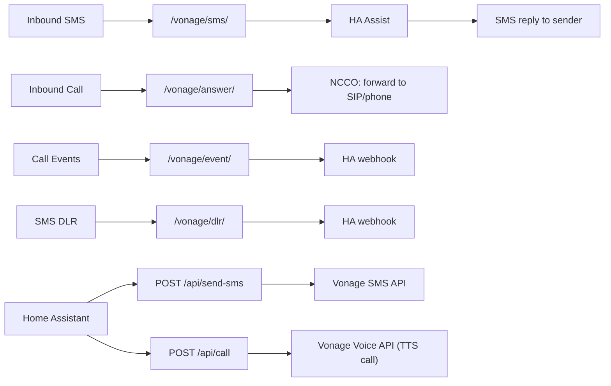

# vonage-ha-bridge

A lightweight Node.js bridge between [Vonage](https://www.vonage.com/) (formerly Nexmo) and [Home Assistant](https://www.home-assistant.io/). It lets you:

- **Receive SMS messages** and forward them to Home Assistant Assist (the voice/conversation assistant), then SMS the reply back to the sender.
- **Receive inbound phone calls** and forward them to a SIP URI or phone number.
- **Send outbound SMS messages and calls** triggered from Home Assistant via a simple internal API.
- **Forward call events and SMS delivery receipts** to Home Assistant webhooks.

---

## Table of Contents

- [How It Works](#how-it-works)
- [Prerequisites](#prerequisites)
- [Installation](#installation)
- [Configuration](#configuration)
- [Running the Service](#running-the-service)
- [API Reference](#api-reference)
- [Vonage Setup](#vonage-setup)
- [Home Assistant Setup](#home-assistant-setup)
- [Security](#security)
- [Docker](#docker)

---

## How It Works



---

## Prerequisites

- Node.js 18+
- A [Vonage account](https://dashboard.vonage.com/) with:
  - An API key and secret
  - A Vonage application with a private key (for Voice/JWT)
  - A phone number linked to that application
- A running Home Assistant instance with a long-lived access token
- A publicly reachable HTTPS URL for Vonage webhooks (e.g. via a reverse proxy or ngrok)

---

## Installation

```bash
git clone https://github.com/ebertek/vonage-ha-bridge.git
cd vonage-ha-bridge
npm install
```

---

## Configuration

All configuration is via environment variables. Copy `.env.example` to `.env` and fill in the values.

### Required

| Variable                  | Description                                                     |
| ------------------------- | --------------------------------------------------------------- |
| `HA_BASE_URL`             | Home Assistant base URL, e.g. `http://homeassistant.local:8123` |
| `HA_LONG_LIVED_TOKEN`     | Home Assistant long-lived access token                          |
| `VONAGE_API_KEY`          | Vonage API key                                                  |
| `VONAGE_API_SECRET`       | Vonage API secret                                               |
| `VONAGE_FROM_NUMBER`      | Your Vonage number (digits only, e.g. `46701234567`)            |
| `VONAGE_APPLICATION_ID`   | Vonage application ID (for Voice/JWT)                           |
| `VONAGE_PRIVATE_KEY_PATH` | Path to your Vonage application's private key file              |
| `INTERNAL_API_TOKEN`      | A secret token for authenticating calls to `/api/*` endpoints   |

### Optional

| Variable                                | Default             | Description                                                                                            |
| --------------------------------------- | ------------------- | ------------------------------------------------------------------------------------------------------ |
| `PORT`                                  | `3000`              | Port to listen on                                                                                      |
| `BASE_URL`                              | _(none)_            | Public base URL of this service (required for voice/outbound calls), e.g. `https://bridge.example.com` |
| `HA_CALL_EVENT_WEBHOOK_ID`              | `vonage_call_event` | HA webhook ID for call events                                                                          |
| `HA_SMS_DLR_WEBHOOK_ID`                 | `vonage_sms_dlr`    | HA webhook ID for SMS delivery receipts                                                                |
| `HA_ASSIST_AGENT_ID`                    | _(none)_            | HA Assist agent ID to use for SMS conversations (uses default if unset)                                |
| `HA_LANGUAGE`                           | `en`                | Language code for HA Assist                                                                            |
| `FORWARD_PHONE_NUMBER`                  | _(none)_            | Phone number to forward inbound calls to                                                               |
| `FORWARD_SIP_URI`                       | _(none)_            | SIP URI to forward inbound calls to (takes priority over phone number)                                 |
| `ALLOWED_SMS_SENDERS`                   | _(all allowed)_     | Comma-separated list of phone numbers allowed to send SMS commands                                     |
| `SMS_MAX_LENGTH`                        | `1600`              | Maximum SMS message length                                                                             |
| `ASSIST_TIMEOUT_MS`                     | `30000`             | Timeout for HA Assist requests                                                                         |
| `OUTBOUND_TIMEOUT_MS`                   | `10000`             | Timeout for outbound HTTP requests                                                                     |
| `VALIDATE_VONAGE_SMS_SIGNATURE`         | `false`             | Enable Vonage SMS signature verification                                                               |
| `VONAGE_SIGNATURE_SECRET`               | _(none)_            | Required if signature validation is enabled                                                            |
| `VONAGE_SIGNATURE_ALGORITHM`            | `md5hash`           | Signature algorithm: `md5hash`, `md5`, `sha1`, `sha256`, or `sha512`                                   |
| `OUTBOUND_CALL_RATE_LIMIT_MAX_REQUESTS` | `3`                 | Max outbound call requests per window                                                                  |
| `OUTBOUND_CALL_RATE_LIMIT_WINDOW_MS`    | `300000`            | Rate limit window for outbound calls (ms)                                                              |
| `OUTBOUND_SMS_RATE_LIMIT_MAX_REQUESTS`  | `5`                 | Max outbound SMS requests per window                                                                   |
| `OUTBOUND_SMS_RATE_LIMIT_WINDOW_MS`     | `15000`             | Rate limit window for outbound SMS (ms)                                                                |
| `LOG_LEVEL`                             | `info`              | Log level: `debug`, `info`, `warning`, or `error`                                                      |
| `DEFAULT_VOICE_LANGUAGE`                | `en-US`             | Default TTS language for outbound calls (Vonage voice language code)                                   |
| `DEFAULT_VOICE_STYLE`                   | `0`                 | Default voice style index for outbound calls (0 = default, varies by voice)                            |

---

## Running the Service

```bash
# Development
node index.js

# With environment file
node --env-file=.env index.js
```

Logs are emitted as newline-delimited JSON to stdout.

---

## API Reference

### Vonage Webhook Endpoints

These are called by Vonage and should be configured in your Vonage application dashboard.

| Method     | Path             | Description                                              |
| ---------- | ---------------- | -------------------------------------------------------- |
| `GET/POST` | `/vonage/sms`    | Inbound SMS receiver                                     |
| `GET/POST` | `/vonage/dlr`    | SMS delivery receipt handler                             |
| `GET/POST` | `/vonage/answer` | Inbound call answer URL (returns NCCO)                   |
| `GET/POST` | `/vonage/event`  | Inbound call event URL                                   |
| `GET`      | `/ncco/talk`     | Returns a talk NCCO for outbound calls (used internally) |

### Internal API Endpoints

These require the `x-api-token` header set to your `INTERNAL_API_TOKEN`.

#### `POST /api/send-sms`

Send an outbound SMS.

**Request body:**

```json
{
  "to": "46701234567",
  "text": "Hello from Home Assistant!",
  "clientRef": "optional-ref"
}
```

#### `POST /api/call`

Initiate an outbound phone call with a text-to-speech message.

**Request body:**

```json
{
  "to": "46701234567",
  "text": "This is an automated alert from Home Assistant.",
  "language": "en-US",
  "style": 0,
  "dtmfAnswer": "1234",
  "mode": "talk"
}
```

| Field                      | Required | Description                                                                                      |
| -------------------------- | -------- | ------------------------------------------------------------------------------------------------ |
| `to`                       | Yes      | Destination phone number (digits only, with country code)                                        |
| `text`                     | Yes      | Text-to-speech message (max 1400 characters)                                                     |
| `language`                 | No       | TTS language code (defaults to `DEFAULT_VOICE_LANGUAGE`)                                         |
| `style`                    | No       | Voice style index (defaults to `DEFAULT_VOICE_STYLE`)                                            |
| `dtmfAnswer`/`dtmf_answer` | No       | DTMF digits to send automatically when the call is answered (only used in `connect` mode)        |
| `mode`                     | No       | `"talk"` (default) plays TTS via answer URL; `"connect"` uses an inline NCCO with connect action |

### Utility Endpoints

| Method | Path       | Description         |
| ------ | ---------- | ------------------- |
| `GET`  | `/`        | Service info        |
| `GET`  | `/health`  | Health check        |
| `GET`  | `/version` | Application version |

---

## Vonage Setup

1. Create a Vonage application in the [dashboard](https://dashboard.vonage.com/applications) with **Voice** and **Messages** capabilities enabled.
2. Set the **Answer URL** to `https://your-domain/vonage/answer` and the **Event URL** to `https://your-domain/vonage/event`.
3. Download the generated private key and save it to the path specified by `VONAGE_PRIVATE_KEY_PATH`.
4. Link your Vonage number to the application.
5. Configure the **Inbound SMS webhook** on your number to point to `https://your-domain/vonage/sms`.
6. Optionally configure the **SMS delivery receipt webhook** to `https://your-domain/vonage/dlr`.

---

## Home Assistant Setup

### Long-lived access token

Generate one in your HA profile page under **Long-lived access tokens** and set it as `HA_LONG_LIVED_TOKEN`.

### Webhooks

To receive call events and SMS delivery receipts in HA, create automations with a **Webhook** trigger. The webhook IDs must match `HA_CALL_EVENT_WEBHOOK_ID` (default: `vonage_call_event`) and `HA_SMS_DLR_WEBHOOK_ID` (default: `vonage_sms_dlr`).

### Sending SMS / calls from HA

Use a `rest_command` to call the internal API. Add the following block in your Home Assistant's `configuration.yaml` file:

```yaml
rest_command:
  make_call:
    content_type: "application/json"
    headers:
      x-api-token: !secret vonage_bridge_api_token
    method: POST
    payload: >
      {
        "to": "{{ to }}",
        "text": "{{ text }}",
        "mode": "{{ mode | default('talk') }}",
        "language": "{{ language | default('en-US') }}",
        "style": "{{ style | default('0') }}",
        "dtmf_answer": "{{ dtmf_answer | default('') }}"
      }
    url: "http://localhost:3000/api/call"
  send_sms:
    content_type: "application/json"
    headers:
      x-api-token: !secret vonage_bridge_api_token
    method: POST
    payload: >
      {
        "to": "{{ to }}",
        "text": "{{ text }}"
      }
    url: "http://localhost:3000/api/send-sms"
```

Add your `INTERNAL_API_TOKEN` in your Home Assistant's `secrets.yaml` file:

```yaml
vonage_bridge_api_token: INTERNAL_API_TOKEN
```

Then call them from an automation action:

```yaml
alias: Announce water leak
description: ""
triggers:
  - trigger: state
    entity_id:
      - binary_sensor.water_leak
    to:
      - "on"
conditions: []
actions:
  - action: notify.hass
    data:
      message: "Water leak detected!"
      target: "1296883565967179786"
  - action: rest_command.make_call
    data:
      to: "46701234567"
      text: "Water leak detected!"
      mode: "talk"
  - action: rest_command.send_sms
    data:
      to: "46701234567"
      text: "Water leak detected!"
mode: single
```

---

## Security

- All `/api/*` endpoints require the `x-api-token` header.
- Inbound SMS can be restricted to specific senders via `ALLOWED_SMS_SENDERS`.
- Vonage SMS signature validation can be enabled via `VALIDATE_VONAGE_SMS_SIGNATURE` for additional assurance that requests originate from Vonage.
- Outbound SMS and call endpoints are rate-limited per destination number.
- Ensure `INTERNAL_API_TOKEN` is a strong random secret and that the service is not publicly accessible on the `/api/*` paths (place it behind a firewall or keep it on your LAN).

---

## Docker

A pre-built image is available from the GitHub Container Registry:

```bash
docker pull ghcr.io/ebertek/vonage-ha-bridge:latest
```

### Running with Docker

```bash
docker run -d \
  --name vonage-ha-bridge \
  --env-file .env \
  -v /path/to/vonage-private.key:/run/secrets/private.key:ro \
  -p 3000:3000 \
  ghcr.io/ebertek/vonage-ha-bridge:latest
```

Make sure `VONAGE_PRIVATE_KEY_PATH` is set to the mounted path (e.g. `/run/secrets/private.key`).

### Docker Compose

```yaml
services:
  vonage-ha-bridge:
    env_file:
      - .env
    image: "ghcr.io/ebertek/vonage-ha-bridge:latest"
    ports:
      - "3000:3000"
    restart: unless-stopped
    volumes:
      - /path/to/private.key:/run/secrets/private.key:ro
```

### Building Locally

The image runs as a non-root user (`appuser`, UID `10001` by default). You can override the UID at build time:

```bash
docker build \
  --build-arg UID=10001 \
  --build-arg VERSION=dev \
  -t vonage-ha-bridge .
```

A health check is built into the image and polls `/health` every 30 seconds.
